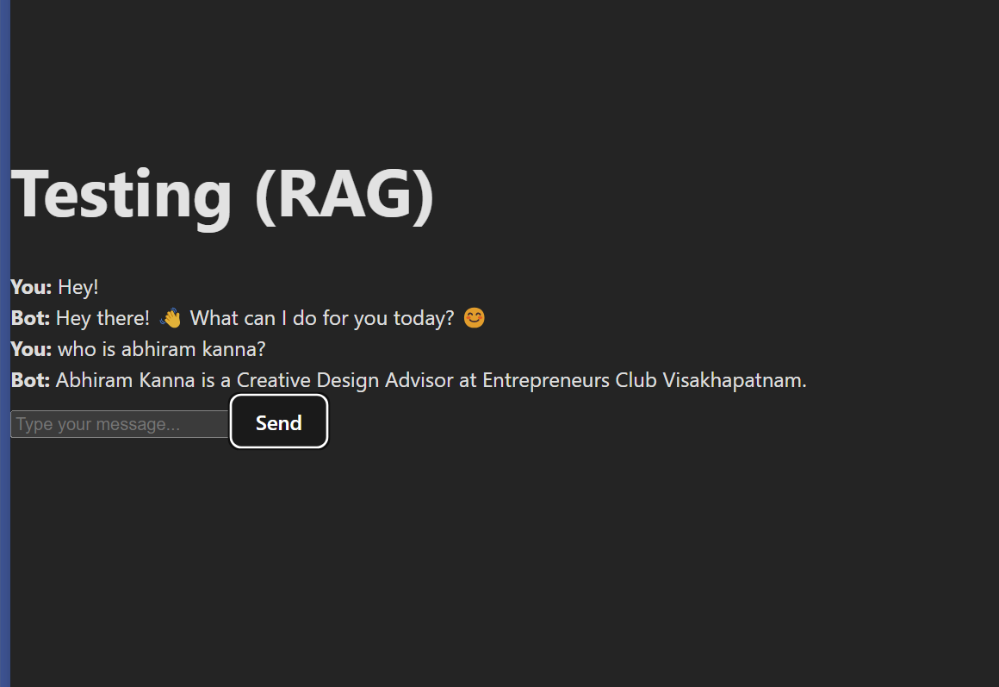

# Chatbot Application

This is a simple chatbot application that uses an OpenAI-compatible API to answer questions based on a predefined knowledge base. The application is built using React and Axios for making HTTP requests.

## Features

- Fetches knowledge base data from a backend server.
- Allows users to send messages and receive responses from the chatbot.
- Displays chat history in a user-friendly interface.

## Demo



## Installation

1. Clone the repository:

   ```sh
   git clone https://github.com/aksisonline/KnowledgeBase-Example-ChatBot.git
   cd KnowledgeBase-Example-ChatBot
   ```
2. Install dependencies:

   ```sh
   bun install
   ```
3. Start the development server:

   ```sh
   bun dev
   ```

## Usage

1. Open your browser and navigate to the port where it's hosted on localhost.
2. Type your message in the input field and click "Send".
3. The chatbot will respond based on the predefined knowledge base.

## Code Overview

The main application code is located in [`src/App.jsx`](src/App.jsx). Here is a brief overview of the key parts:

- **State Management**: The application uses React's `useState` to manage the chat history, input field, and knowledge base.
- **Fetching Knowledge Base**: The knowledge base is fetched from a backend server using `axios` inside a `useEffect` hook.
- **Sending Messages**: The `handleSendMessage` function handles sending user messages to the OpenAI-compatible API and updating the chat history with the bot's response.

## Configuration

- **API Endpoints**: Update the API endpoints in [`src/App.jsx`](src/App.jsx) to match your backend server and OpenAI-compatible API.
- **Authorization**: Ensure you have the correct authorization headers set for the API requests.

## Contributing

Feel free to submit issues or pull requests if you have any improvements or bug fixes.

## License

This project is licensed under the MIT License.
